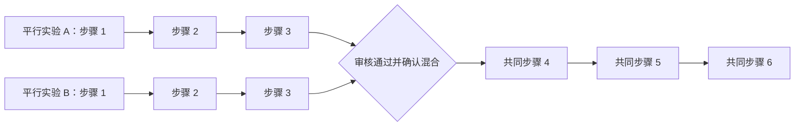

# 平行实验混合合并：设计、实现与验证

版本 v1.0.4，用户已明确授权新增并部署此次合并数据库方案。实际部署文件为 `supabase/migrations/20261008110000_parallel_experiment_merge.sql`，已同步 `supabase_schema.sql`；提案保留供审阅。

## 用户看到的流程

每条平行支路保留自己前置步骤的数值、备注、照片/视频和时间。确认混合后，新建一条共同阶段，仅保存后续步骤；用户只需填写一次。流程图的支路可点击查看原始记录，共同阶段沿用方案的第 4–6 步编号。主页只列唯一共同阶段，完成后保留“最近完成的合并实验”入口。

## 审核门

1. 选择 2–8 个属于当前账号、进行中、未合并的平行实验，指定“完成第几步之后混合”。前后必须都有步骤。
2. **整套定义必须一致**：全部前置和后置步骤的数量、顺序、标题、说明、注意事项、字段名/类型/单位、时长及热解条件。只忽略排版空白，保留字母大小写以区分科学单位；不是只检查后续，也不靠 AI 或名称相似度判定。
3. 每条支路的全部前置步骤必须标记完成；后续不得已有值、备注、附件、勾选或完成记录。程序自动写入的空步骤开始时间不算实验数据。
4. 实测数据允许分别记录不同数值，这不是“模板不一致”。样品标识、真实操作条件和混合事实仍由用户校对。若实验计划中的条件不同，必须阻止合并。
5. 旧关联、新旧混用、重复父实验、嵌套合并均阻止；旧关系需用户另行处理，不自动转换。
6. 本地预检后由数据库复核，保存审核时所有父实验和步骤的版本。选择改变必须重审；审核后有任何数据改动，提交时拒绝并要求重新审核。
7. 当前登录用户勾选“已核对并确认混合”，填写合并说明后提交。这是技术校验加操作者确认，尚不是有独立审核员角色的审批系统。

## 数据模型与事务

新增 `experiment_merge_groups` 保存唯一共同阶段 ID、合并边界、完整定义快照、审核版本、确认人/时间和说明；`experiment_merge_members` 保存独立支路归属。两个表启用 RLS，只能读取自己的关系；普通客户端无直接写入/修改/删除权限，由受控 RPC 写入。

`research_review_merge` 返回审核结果与版本；`research_merge_runs` 在同一事务中锁定父实验与步骤、重新校验、创建共同阶段和所有后续步骤、写入关系和确认记录。失败整笔回滚；同一成功提交丢失响应后重试会返回已有共同阶段。

共同阶段的步骤在库内独立编号 0…N，显示时加上合并边界偏移。原始父实验所有行原样保留，没有复制前置数值到共同阶段，也没有把共同数值回写父实验。父实验仍使用现有 status 结构，但从“进行中”列表排除，明确显示已合并。

触发器冻结已合并父实验及其所有步骤；共同阶段的步骤定义、关系、归属不可改，全部后续步骤完成后才可结束，结束后执行记录只读。防护作用于数据库写入，直接 API 也不能绕过。新触发器还会拒绝新写入的跨账号父子归属和更换步骤归属。

合并事务不删除、覆盖现有实验或转换旧关联。两张关系表有外键，已混合链路不支持直接删除或拆分；后续若需要终止/更正，须单独设计保留审计历史的流程。

## 导出与历史

Word 和自动日志分别列出 A 的前置步骤、B 的前置步骤、唯一的共同后续。保留数值零、附件来源、确认说明和各阶段 ID。已完成共同阶段保留查看及导出入口；首页最近历史只列最近 5 项，完整长期历史列表可后续扩展。

## 本地验证结果

- 35 项自动回归全部通过，无跳过；新增真实 PostgreSQL 引擎测试覆盖前/后置条件不一致、未完成前置、后续已有数据、审核后修改、事务回滚、重复提交、账号隔离、客户端不能写关系表、原支路冻结、共同定义冻结和完成锁定。
- 本地浏览器用独立虚构数据完成：第三步后合并、A/B 原始值 3/5 分别保留并只读、共同步骤沿用 4/5/6 编号、共同数据零值保存、完成生成完整日志、刷新后恢复、已完成入口和 Word 下载。
- 已解析实际导出的 Word XML：共 9 个步骤段落，两个前置支路各 3 步，共同 4–6 步各只出现一次，数值 0 保留。
- 桌面及 390px 手机布局均已检查。按用户要求，手机端流程图保持横向支路汇合，通过板块内左右滑动查看；输入表单仍按手机宽度显示，页面本身不横向溢出。截图位于 `outputs/parallel-merge-desktop-v1.0.4.jpg` 和 `outputs/parallel-merge-mobile-v1.0.4.jpg`，不提交到公共仓库。
- 尚未在真实 Supabase 数据上执行新合并。生产发布通过 push master 触发官方集成，发布后核实迁移检查结果、接口可用性和线上版本。

## 发布验证步骤

授权后的新增迁移及 schema 参考随 v1.0.4 一起提交。重跑回归、浏览器验证与暂存检查后推送 master；确认 Supabase 检查和 GitHub Pages 均成功且线上版本为 v1.0.4，通过不写入真实记录的接口探测核实 RPC 已部署。不得修改已应用迁移或自行清理旧关系/真实数据。

本次浏览器测试生成两份虚构数据 Word 文件在本机 Downloads；截图及本地模拟数据保留，未执行文件清理或真实记录删除。
